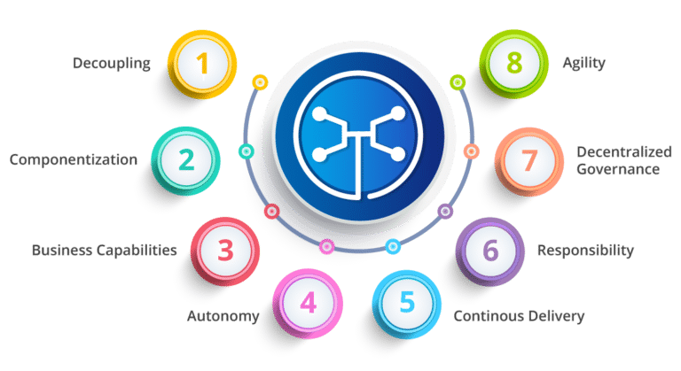
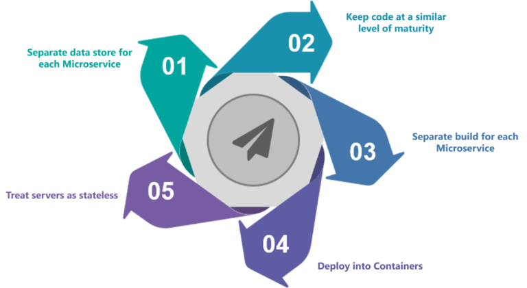
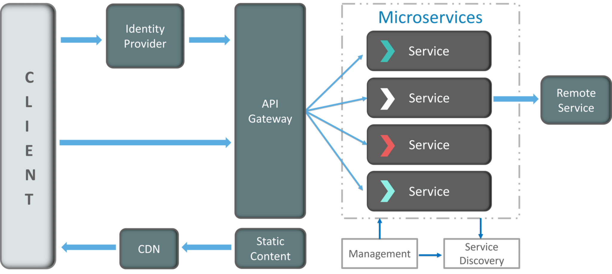
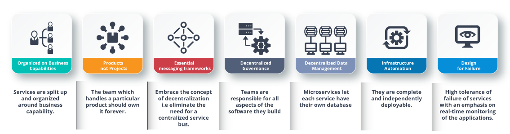

# Microservices Interview

### Q1. List down the advantages of Microservices Architecture.

-   **Independent Development**

    All microservices can be easily developed based on their individual functionality

-   **Independent Deployment**

    Based on their services, they can be individually deployed in any application

-   **Fault Isolation**

    Even if one service of the application does not work, the system still continues to function

-   **Mixed Technology Stack**

    Different languages and technologies can be used to build different services of the same application

-   **Granular Scaling**

    Individual components can scale as per need, there is no need to scale all components together

### Q2. What do you know about Microservices?

-   **Microservices**, aka **Microservice Architecture**, is an architectural style that structures an application as a collection of small autonomous services, modeled around a **business domain**.
-   In layman terms, you must have seen how bees build their honeycomb by aligning hexagonal wax cells.
-   They initially start with a small section using various materials and continue to build a large beehive out of it.
-   These cells form a pattern resulting in a strong structure which holds together a particular section of the beehive.
-   Here, each cell is independent of the other but it is also correlated with the other cells.
-   This means that damage to one cell does not damage the other cells, so, bees can reconstruct these cells without impacting the complete beehive.

**Fig 1**: Beehive Representation of Microservices

Refer to the above diagram. Here, each hexagonal shape represents an individual service component. Similar to the working of bees, each agile team builds an individual service component with the available frameworks and the chosen technology stack. Just as in a beehive, each service component forms a strong microservice architecture to provide better scalability. Also, issues with each service component can be handled individually by the agile team with no or minimal impact on the entire application.

### Q3. What are the features of Microservices?

**Fig 2**: Features of Microservices

-   **Decoupling** – Services within a system are largely decoupled. So the application as a whole can be easily built, altered, and scaled
-   **Componentization** – Microservices are treated as independent components that can be easily replaced and upgraded
-   **Business Capabilities** – Microservices are very simple and focus on a single capability
-   **Autonomy** – Developers and teams can work independently of each other, thus increasing speed
-   **Continous Delivery** – Allows frequent releases of software, through systematic automation of software creation, testing, and approval
-   **Responsibility** – Microservices do not focus on applications as projects. Instead, they treat applications as products for which they are responsible
-   **Decentralized Governance** – The focus is on using the right tool for the right job. That means there is no standardized pattern or any technology pattern. Developers have the freedom to choose the best useful tools to solve their problems
-   **Agility** – Microservices support agile development. Any new feature can be quickly developed and discarded again

### Q4. What are the best practices to design Microservices?

The following are the best practices to design microservices:

**Fig 3**: Best Practices to Design Microservices

### Q5. How does Microservice Architecture work?

A microservice architecture has the following components:

**Fig 4**: Architecture of Microservices

-   **Clients** – Different users from various devices send requests.
-   **Identity Providers** – Authenticates user or clients identities and issues security tokens.
-   **API Gateway** – Handles client requests.
-   **Static Content** – Houses all the content of the system.
-   **Management** –  Balances services on nodes and identifies failures.
-   **Service Discovery** – A guide to find the route of communication between microservices.
-   **Content Delivery Networks** – Distributed network of proxy servers and their data centers.
-   **Remote Service** – Enables the remote access information that resides on a network of IT devices.

### Q6. What are the pros and cons of Microservice Architecture?

#### Pros of Microservice Architecture
-   Freedom to use different technologies
-   Each microservices focuses on single capability
-   Supports individual deployable units
-   Allow frequent software releases
-   Ensures security of each service
-   Mulitple services are parallelly developed and deployed

#### Cons of Microservice Architecture
-   Increases troubleshooting challenges
-   Increases delay due to remote calls
-   Increased efforts for configuration and other operations
-   Difficult to maintain transaction safety
-   Tough to track data across various boundaries
-   Difficult to code between services

### Q7. What is the difference between Monolithic, SOA and Microservices Architecture?

**Fig 5**: Comparison Between Monolithic SOA & Microservices

-   **Monolithic Architecture** is similar to a big container wherein all the software components of an application are assembled together and tightly packaged.
-   A **Service-Oriented Architecture** is a collection of services which communicate with each other. The communication can involve either simple data passing or it could involve two or more services coordinating some activity.
-   **Microservice Architecture** is an architectural style that structures an application as a collection of small autonomous services, modeled around a business domain.

### Q8. What are the challenges you face while working Microservice Architectures?
Developing a number of smaller microservices sounds easy, but the challenges often faced while developing them are as follows.

-   **Automate the Components**: Difficult to automate because there are a number of smaller components. So for each component, we have to follow the stages of  Build, Deploy and, Monitor.
-   **Perceptibility**: Maintaining a large number of components together becomes difficult to deploy, maintain, monitor and identify problems. It requires great perceptibility around all the components.
-   **Configuration Management**: Maintaining the configurations for the components across the various environments becomes tough sometimes.
-   **Debugging**: Difficult to find out each and every service for an error. It is essential to maintain centralized logging and dashboards to debug problems.

### Q9. What are the key differences between SOA and Microservices Architecture?

The key differences between SOA and microservices are as follows:

**SOA**
-   Follows “**share-as-much-as-possible**” architecture approach
-   Importance is on **business functionality** reuse
-   They have **common governance** and standards
-   Uses **Enterprise Service bus (ESB)** for communication
-   They support **multiple message protocols**
-   **Multi-threaded** with more overheads to handle I/O
-   Maximizes application service reusability
-   **Traditional Relational Databases** are more often used
-   A systematic change requires modifying the monolith
-   DevOps / Continuous Delivery is becoming popular, but not yet mainstream

**Microservices**
-   Follows “**share-as-little-as-possible**” architecture approach
-   Importance is on the concept of “**bounded context**”
-   They focus on **people collaboration** and freedom of other options
-   Simple messaging system
-   They use **lightweight protocols** such as **HTTP/REST** etc.
-   **Single-threaded** usually with the use of Event Loop features for non-locking I/O handling
-   Focuses on **decoupling**
-   **Modern Relational Databases** are more often used
-   A systematic change is to create a new service
-   Strong focus on DevOps / Continuous Delivery

### Q10. What are the characteristics of Microservices?

**Fig 6**: Characteristics of Microservices