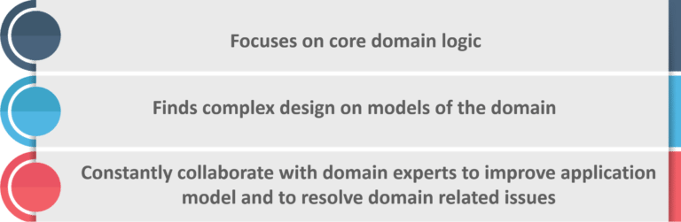
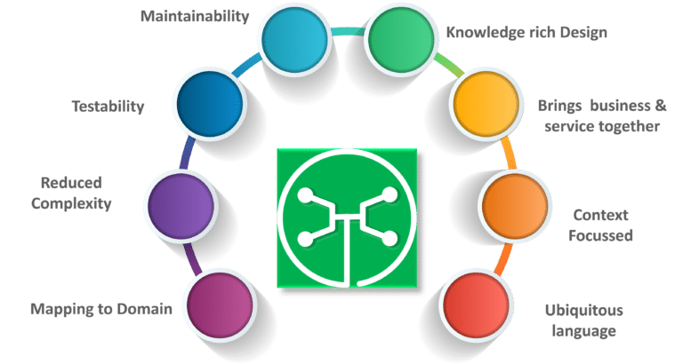
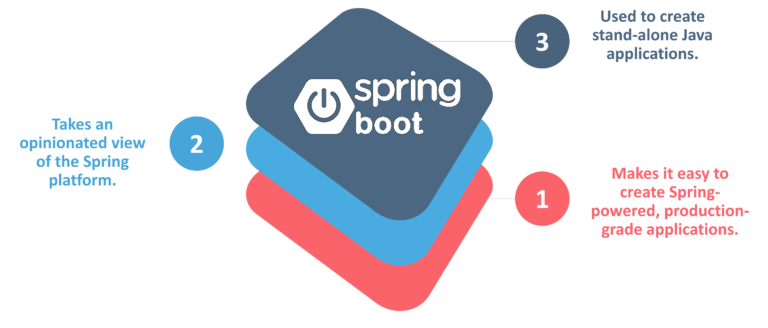
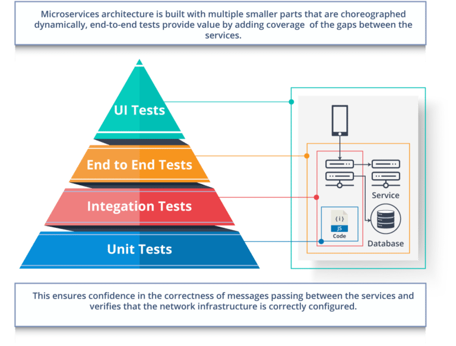
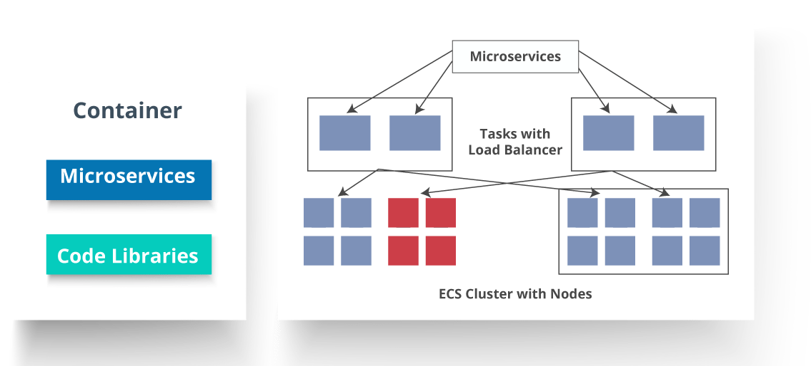
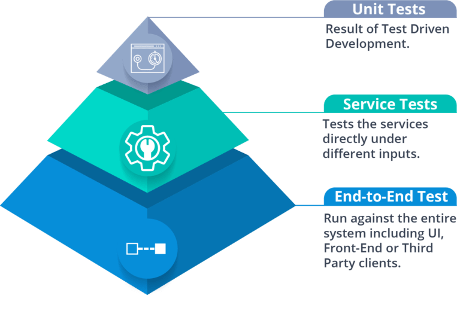

# Microservices Interview

### Q1. List down the advantages of Microservices Architecture.

-   **Independent Development**

    All microservices can be easily developed based on their individual functionality

-   **Independent Deployment**

    Based on their services, they can be individually deployed in any application

-   **Fault Isolation**

    Even if one service of the application does not work, the system still continues to function

-   **Mixed Technology Stack**

    Different languages and technologies can be used to build different services of the same application

-   **Granular Scaling**

    Individual components can scale as per need, there is no need to scale all components together

### Q2. What do you know about Microservices?

-   **Microservices**, aka **Microservice Architecture**, is an architectural style that structures an application as a collection of small autonomous services, modeled around a **business domain**.
-   In layman terms, you must have seen how bees build their honeycomb by aligning hexagonal wax cells.
-   They initially start with a small section using various materials and continue to build a large beehive out of it.
-   These cells form a pattern resulting in a strong structure which holds together a particular section of the beehive.
-   Here, each cell is independent of the other but it is also correlated with the other cells.
-   This means that damage to one cell does not damage the other cells, so, bees can reconstruct these cells without impacting the complete beehive.

**Fig 1**: Beehive Representation of Microservices

Refer to the above diagram. Here, each hexagonal shape represents an individual service component. Similar to the working of bees, each agile team builds an individual service component with the available frameworks and the chosen technology stack. Just as in a beehive, each service component forms a strong microservice architecture to provide better scalability. Also, issues with each service component can be handled individually by the agile team with no or minimal impact on the entire application.

### Q3. What are the features of Microservices?

**Fig 2**: Features of Microservices

-   **Decoupling** – Services within a system are largely decoupled. So the application as a whole can be easily built, altered, and scaled
-   **Componentization** – Microservices are treated as independent components that can be easily replaced and upgraded
-   **Business Capabilities** – Microservices are very simple and focus on a single capability
-   **Autonomy** – Developers and teams can work independently of each other, thus increasing speed
-   **Continous Delivery** – Allows frequent releases of software, through systematic automation of software creation, testing, and approval
-   **Responsibility** – Microservices do not focus on applications as projects. Instead, they treat applications as products for which they are responsible
-   **Decentralized Governance** – The focus is on using the right tool for the right job. That means there is no standardized pattern or any technology pattern. Developers have the freedom to choose the best useful tools to solve their problems
-   **Agility** – Microservices support agile development. Any new feature can be quickly developed and discarded again

### Q4. What are the best practices to design Microservices?

The following are the best practices to design microservices:

**Fig 3**: Best Practices to Design Microservices

### Q5. How does Microservice Architecture work?

A microservice architecture has the following components:

**Fig 4**: Architecture of Microservices

-   **Clients** – Different users from various devices send requests.
-   **Identity Providers** – Authenticates user or clients identities and issues security tokens.
-   **API Gateway** – Handles client requests.
-   **Static Content** – Houses all the content of the system.
-   **Management** –  Balances services on nodes and identifies failures.
-   **Service Discovery** – A guide to find the route of communication between microservices.
-   **Content Delivery Networks** – Distributed network of proxy servers and their data centers.
-   **Remote Service** – Enables the remote access information that resides on a network of IT devices.

### Q6. What are the pros and cons of Microservice Architecture?

#### Pros of Microservice Architecture
-   Freedom to use different technologies
-   Each microservices focuses on single capability
-   Supports individual deployable units
-   Allow frequent software releases
-   Ensures security of each service
-   Mulitple services are parallelly developed and deployed

#### Cons of Microservice Architecture
-   Increases troubleshooting challenges
-   Increases delay due to remote calls
-   Increased efforts for configuration and other operations
-   Difficult to maintain transaction safety
-   Tough to track data across various boundaries
-   Difficult to code between services

### Q7. What is the difference between Monolithic, SOA and Microservices Architecture?

**Fig 5**: Comparison Between Monolithic SOA & Microservices

-   **Monolithic Architecture** is similar to a big container wherein all the software components of an application are assembled together and tightly packaged.
-   A **Service-Oriented Architecture** is a collection of services which communicate with each other. The communication can involve either simple data passing or it could involve two or more services coordinating some activity.
-   **Microservice Architecture** is an architectural style that structures an application as a collection of small autonomous services, modeled around a business domain.

### Q8. What are the challenges you face while working Microservice Architectures?
Developing a number of smaller microservices sounds easy, but the challenges often faced while developing them are as follows.

-   **Automate the Components**: Difficult to automate because there are a number of smaller components. So for each component, we have to follow the stages of  Build, Deploy and, Monitor.
-   **Perceptibility**: Maintaining a large number of components together becomes difficult to deploy, maintain, monitor and identify problems. It requires great perceptibility around all the components.
-   **Configuration Management**: Maintaining the configurations for the components across the various environments becomes tough sometimes.
-   **Debugging**: Difficult to find out each and every service for an error. It is essential to maintain centralized logging and dashboards to debug problems.

### Q9. What are the key differences between SOA and Microservices Architecture?

The key differences between SOA and microservices are as follows:

**SOA**
-   Follows “**share-as-much-as-possible**” architecture approach
-   Importance is on **business functionality** reuse
-   They have **common governance** and standards
-   Uses **Enterprise Service bus (ESB)** for communication
-   They support **multiple message protocols**
-   **Multi-threaded** with more overheads to handle I/O
-   Maximizes application service reusability
-   **Traditional Relational Databases** are more often used
-   A systematic change requires modifying the monolith
-   DevOps / Continuous Delivery is becoming popular, but not yet mainstream

**Microservices**
-   Follows “**share-as-little-as-possible**” architecture approach
-   Importance is on the concept of “**bounded context**”
-   They focus on **people collaboration** and freedom of other options
-   Simple messaging system
-   They use **lightweight protocols** such as **HTTP/REST** etc.
-   **Single-threaded** usually with the use of Event Loop features for non-locking I/O handling
-   Focuses on **decoupling**
-   **Modern Relational Databases** are more often used
-   A systematic change is to create a new service
-   Strong focus on DevOps / Continuous Delivery

### Q10. What are the characteristics of Microservices?

**Fig 6**: Characteristics of Microservices

### What is Domain Driven Design?

**Fig 8**: Principles of DDD

### Q12. Why there is a need for Domain Driven Design (DDD)?

**Fig 8**: Factors Why we need DDD

### Q13. What is Cohesion?
The degree to which the elements inside a module belong together is said to be **cohesion**.

### Q14.  What is Coupling?
The measure of the strength of the dependencies between components is said to be **coupling**. A good design is always said to have High **Cohesion** and **Low Coupling**.

### Q15.  What is REST/RESTful and what are its uses?
**Representational State Transfer (REST)/RESTful** web services are an architectural style to help computer systems communicate over the internet. This makes microservices easier to understand and implement.

Microservices can be implemented with or without RESTful APIs, but it’s always easier to build loosely coupled microservices using RESTful APIs.

### Q16. What do you know about Spring Boot?
It’s a knows fact that spring has become more and more complex as new functionalities have been added. If you have to start a new spring project, then you have to add build path or add maven dependencies, configure application server, add spring configuration. So everything has to be done from scratch.

**Spring Boot** is the solution to this problem. Using spring boot you can avoid all the boilerplate code and configurations. So basically consider yourself as if you’re baking a cake spring is like the ingredients that are required to make the cake and spring boot is the complete cake in your hand.

**Fig 8**: Factors of Spring Boot 

### Q17. Can you give a gist about Rest and Microservices?

**REST**

Though you can implement microservices in multiple ways, REST over HTTP is a way to implement Microservices. REST is also used in other applications such as web apps, API design, and MVC applications to serve business data.

**Microservices**

Microservices is an architecture wherein all the components of the system are put into individual components, which can be built, deployed, and scaled individually. There are certain principles and best practices of Microservices that help in building a resilient application.

In a nutshell, you can say that REST is a medium to build Microservices.

### Q18. What are different types of Tests for Microservices?

While working with microservices, testing becomes quite complex as there are multiple microservices working together. So, tests are divided into different levels.

-   At the **bottom level**, we have **technology-facing tests** like- unit tests and performance tests. These are completely automated.
-   At the **middle level**, we have tests for **exploratory testing** like the stress tests and usability tests.
-   At the **top level**, we have **acceptance tests** that are few in number. These acceptance tests help stakeholders in understanding and verifying software features.

### Q19. What do you understand by Distributed Transaction?

**Distributed Transaction** is any situation where a single event results in the mutation of two or more separate sources of data which cannot be committed atomically. In the world of microservices, it becomes even more complex as each service is a unit of work and most of the time multiple services have to work together to make a business successful.

### Q20. What is an Idempotence and where it is used?
**Idempotence** is the property of being able to do something twice in such a way that the end result will remain the same i.e. as if it had been done once only.

**Usage**: **Idempotence** is used at the remote service, or data source so that, when it receives the instruction more than once, it only processes the instruction once.

### Q21. What is Bounded Context?
**Bounded Context** is a central pattern in Domain-Driven Design. It is the focus of DDD’s strategic design section which is all about dealing with large models and teams. DDD deals with large models by dividing them into different Bounded Contexts and being explicit about their inter-relationships.

### Q22. What do you understand by Contract Testing?

According to Martin Flower, **contract test** is a test at the boundary of an external service which verifies that it meets the contract expected by a consuming service.

Also, contract testing does not test the behavior of the service in depth. Rather, it tests that the inputs & outputs of service calls contain required attributes and the response latency, throughput is within allowed limits.

### Q23. What is End to End Microservices Testing?

End-to-end testing validates each and every process in the workflow is functioning properly. This ensures that the system works together as a whole and satisfies all requirements.

In layman terms, you can say that end to end testing is a kind of tests where everything is tested after a particular period.

**Fig 9**: Hierarchy of Tests 

### Q24. What is the use of Container in Microservices?

Containers are a good way to manage microservice based application to develop and deploy them individually. You can encapsulate your microservice in a container image along with its dependencies, which then can be used to roll on-demand instances of microservice without any additional efforts required.

**Fig 10**: Representation of Containers and How they are used in Microservices

### Q25. What is DRY in Microservices architecture?

**DRY** stands for **Don’t Repeat Yourself**. It basically promotes the concept of reusing the code. This results in developing and sharing the libraries which in turn result in tight coupling.

### Q26. What is a Consumer-Driven Contract (CDC)?

This is basically a pattern for developing Microservices so that they can be used by external systems. When we work on microservices, there is a particular provider who builds it and there are one or more consumers who use Microservice.

Generally, providers specify the interfaces in an XML document. But in Consumer Driven Contract, each consumer of service conveys the interface expected from the Provider.

### Q27. What is the role of Web, RESTful APIs in Microservices?

A microservice architecture is based on a concept wherein all its services should be able to interact with each other to build a business functionality. So, to achieve this, each microservice must have an interface. This makes the web API a very important enabler of microservices. Being based on the open networking principles of the Web, RESTful APIs provide the most logical model for building interfaces between the various components of a microservice architecture.

### Q28. What do you understand by Semantic monitoring in Microservices architecture?

Semantic monitoring, also known as **synthetic monitoring** combines automated tests with monitoring the application in order to detect business failing factors.

### Q29.  How can we perform Cross-Functional testing?
Cross-functional testing is a verification of non-functional requirements, i.e. those requirements which cannot be implemented like a normal feature.

### Q30. What is the difference between Mock or Stub?

**Stub**

-   A dummy object that helps in running the test.
-   Provides fixed behavior under certain conditions which can be hard-coded.
-   Any other behavior of the stub is never tested.

For example, for an empty stack, you can create a stub that just returns true for empty() method. So, this does not care whether there is an element in the stack or not.

**Mock**

-   A dummy object in which certain properties are set initially.
-   The behavior of this object depends on the set properties.
-   The object’s behavior can also be tested.

For example, for a Customer object, you can mock it by setting name and age. You can set age as 12 and then test for isAdult() method that will return true for age greater than 18. So, your Mock Customer object works for the specified condition.

### Q31. What do you know about Mike Cohn’s Test Pyramid?

**Mike Cohn** provided a model called **Test Pyramid**. This describes the kind of automated tests required for software development.

**Fig 11**: Mike Cohn’s Test Pyramid 

As per pyramid, the number of tests at first layer should be highest. At service layer, the number of tests should be less than at the unit test level, but more than at the end-to-end level.

### Q32. What is the purpose of Docker?

**Docker** provides a container environment that can be used to host any application. In this, the software application and the dependencies which support it are tightly-packaged together.

So, this packaged product is called a Container and since it is done by Docker, it is called **Docker container**!

### Q33. What is the role of an architect in Microservices architecture?

An architect in microservices architecture plays the following roles:

-   Decides broad strokes about the layout of the overall software system.
-   Helps in deciding the zoning of the components. So, they make sure components are mutually cohesive, but not tightly coupled.
-   Code with developers and learn the challenges faced in day-to-day life.
-   Make recommendations for certain tools and technologies to the team developing microservices.
-   Provide technical governance so that the teams in their technical development follow principles of Microservice.