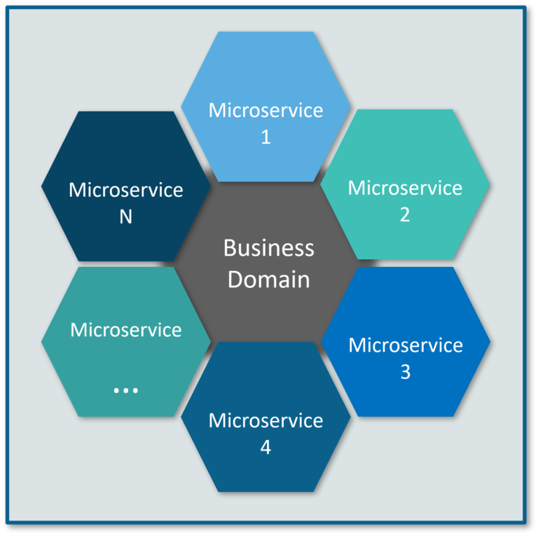

# Microservices Interview

#### Q1. List down the advantages of Microservices Architecture.

-   **Independent Development**

    All microservices can be easily developed based on their individual functionality

-   **Independent Deployment**

    Based on their services, they can be individually deployed in any application

-   **Fault Isolation**

    Even if one service of the application does not work, the system still continues to function

-   **Mixed Technology Stack**

    Different languages and technologies can be used to build different services of the same application

-   **Granular Scaling**

    Individual components can scale as per need, there is no need to scale all components together

#### Q2. What do you know about Microservices?

-   **Microservices**, aka **Microservice Architecture**, is an architectural style that structures an application as a collection of small autonomous services, modeled around a **business domain**.
-   In layman terms, you must have seen how bees build their honeycomb by aligning hexagonal wax cells.
-   They initially start with a small section using various materials and continue to build a large beehive out of it.
-   These cells form a pattern resulting in a strong structure which holds together a particular section of the beehive.
-   Here, each cell is independent of the other but it is also correlated with the other cells.
-   This means that damage to one cell does not damage the other cells, so, bees can reconstruct these cells without impacting the complete beehive.

**Fig 1**: Beehive Representation of Microservices

Refer to the above diagram. Here, each hexagonal shape represents an individual service component. Similar to the working of bees, each agile team builds an individual service component with the available frameworks and the chosen technology stack. Just as in a beehive, each service component forms a strong microservice architecture to provide better scalability. Also, issues with each service component can be handled individually by the agile team with no or minimal impact on the entire application.

#### Q3. What are the features of Microservices?

**Fig 2**: Features of Microservices

-   **Decoupling** – Services within a system are largely decoupled. So the application as a whole can be easily built, altered, and scaled
-   **Componentization** – Microservices are treated as independent components that can be easily replaced and upgraded
-   **Business Capabilities** – Microservices are very simple and focus on a single capability
-   **Autonomy** – Developers and teams can work independently of each other, thus increasing speed
-   **Continous Delivery** – Allows frequent releases of software, through systematic automation of software creation, testing, and approval
-   **Responsibility** – Microservices do not focus on applications as projects. Instead, they treat applications as products for which they are responsible
-   **Decentralized Governance** – The focus is on using the right tool for the right job. That means there is no standardized pattern or any technology pattern. Developers have the freedom to choose the best useful tools to solve their problems
-   **Agility** – Microservices support agile development. Any new feature can be quickly developed and discarded again

#### Q4. What are the best practices to design Microservices?

The following are the best practices to design microservices:

**Fig 3**: Best Practices to Design Microservices

#### Q5. How does Microservice Architecture work?

A microservice architecture has the following components:

**Fig 5**: Architecture of Microservices